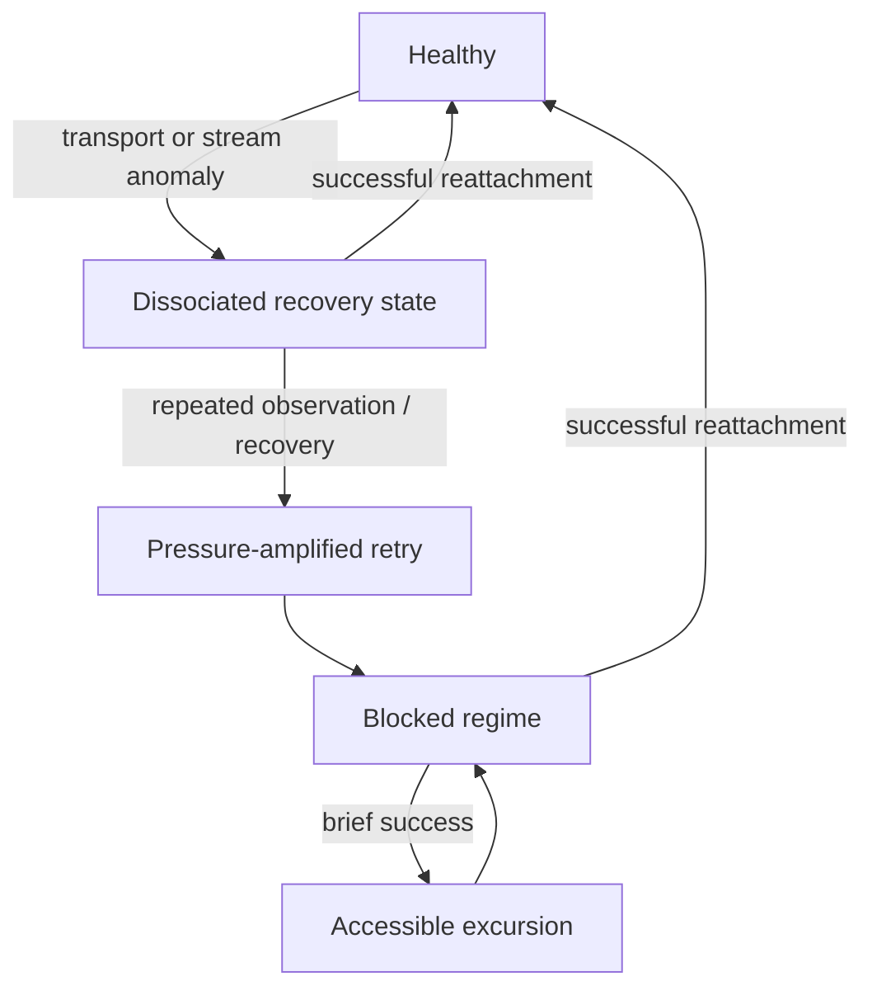

# ChatGPT Conversation Recovery Dynamics

A sanitized, client-side case study of a ChatGPT conversation-loading failure.

The central observation is not simply “HTTP 429 happened.” In one captured session, conversation snapshot access and stream-status observation switched together between two regimes, while recovery/resume behavior changed separately. The resulting pattern is compatible with a **recovery-first positive-feedback hypothesis**:

> recovery/observation degrades → retry cadence increases → request pressure rises → 429s appear → recovery becomes harder

This repository does **not** claim to identify OpenAI's internal root cause. It publishes sanitized derived observations and a falsifiable model that others can test against their own captures.

## Why this is interesting

A UI that cannot render a conversation does not necessarily imply that the canonical conversation is gone.

The capture contains states consistent with:

- conversation snapshots returning successfully while a resume request returns 404;
- later transitions into a paired blocked regime:
  - `stream_status`: no HTTP response
  - conversation snapshot: HTTP 429
- blocked observations occurring at a faster cadence than accessible observations;
- a later successful long-lived resume after WebSocket reconnection activity.

This suggests a useful systems principle:

> **Observed failure ≠ global system failure.**

The user-visible state may be the projection of several partially independent control/observation planes.

## Dataset

Raw HAR files are **not** included.

Only derived fields are published:

- relative time from the first retained event;
- coarse event class;
- HTTP/transport status;
- request latency;
- payload size rounded to 4 KiB.

Excluded data includes:

- cookies and authorization material;
- request/response headers;
- request/response bodies;
- account, user, project and conversation identifiers;
- exact URLs and query strings;
- absolute timestamps;
- message content.

See [`docs/privacy.md`](docs/privacy.md).

## Observed session

Two HAR captures were available. Capture A contained 345 entries; 341 matched entries in the larger 1,705-entry Capture B. To avoid double counting, all quantitative analysis below uses **Capture B only**.

Among retained recovery-related events:

| Event class | Count |
|---|---:|
| stream status observations | 122 |
| conversation snapshots | 114 |
| WebSocket attempts | 14 |
| conversation resume attempts | 3 |
| **total** | **253** |

### Coupled accessible / blocked regimes

A stream-status observation and conversation snapshot were paired when their start times were within 50 ms.

There were **108 paired observations**:

| Regime | stream status | snapshot | Count |
|---|---|---|---:|
| Accessible | HTTP 200 | HTTP 200 | 48 |
| Blocked | no HTTP response | HTTP 429 | 60 |
| Mixed | any other combination | — | **0** |

The absence of mixed pairs in this capture is consistent with a shared latent regime affecting multiple client-side observations.

### Cadence and latency shift

Median time until the next paired observation:

- Accessible: **10.272 s**
- Blocked: **5.998 s**

That is about a **1.71× higher observation-attempt cadence** in the blocked regime.

Median latency:

| Metric | Accessible | Blocked |
|---|---:|---:|
| stream-status latency | 3570.987 ms | 340.994 ms |
| snapshot latency | 5099.194 ms | 325.632 ms |

The blocked snapshot path failed about **15.7× faster** by median latency.

### Persistence

Observed transition counts:

- Accessible → Accessible: 38
- Accessible → Blocked: 10
- Blocked → Blocked: 50
- Blocked → Accessible: 9

So, in this sample:

`P(Blocked next | Blocked now) = 0.847458`

There were 10 blocked runs, with a median length of **7.5 observations** and median duration of **40.504 s**.

### Resume observations

Two resume attempts returned HTTP 404 before later 429 periods.

Episode 1:

- first snapshot 429 appeared **349.013 s** after the resume 404;
- **32** successful snapshots occurred first;
- those successful snapshots represented about **146.331 MiB** of response payload.

Episode 2:

- first snapshot 429 appeared **87.853 s** after the resume 404;
- **8** successful snapshots occurred first;
- about **36.583 MiB** of successful snapshot payload was transferred.

A later resume attempt returned HTTP 200 and remained active for about **135.8 s**.

These timestamps are useful because they weaken a simple “429 always causes resume failure” explanation for this capture. They do **not** prove that resume failure causes the later 429s.

## DCS-inspired model

Here **DCS** means *dissociated control states*: a systems framing in which capability, accessibility, observability, recovery attachment, pressure, and user-visible utility are modeled as separate variables rather than collapsed into a single “working/broken” bit.

Let:

- `C_t`: canonical conversation availability
- `A_t`: snapshot accessibility
- `O_t`: stream/realtime observability
- `R_t`: recovery/resume attachment
- `L_t`: request/rate-limit pressure
- `U_t`: user-visible task utility

A minimal feedback model is:

```text
retry_intensity_t = baseline + k * (1 - observability_t)

pressure_(t+1) =
    rho * pressure_t
    + alpha * retry_intensity_t
    - decay

P(429) = sigmoid(pressure_t - threshold)
```

This produces a testable failure mode:

```text
Observability ↓
      ↓
Retry intensity ↑
      ↓
Request pressure ↑
      ↓
Accessibility ↓
      ↓
Observability ↓
```

A recovery mechanism intended as negative feedback can therefore become **positive feedback** when its state estimate is wrong or incomplete.

See [`docs/model.md`](docs/model.md).

## State-machine hypothesis



This is a hypothesis, not a reconstruction of OpenAI's internal architecture.

## Reproduce with your own HAR

**Do not publish raw HAR files.** They can contain sensitive authentication and account material.

The included standard-library-only extractor emits a coarse public dataset:

```bash
python3 scripts/extract_public_events.py input.har output.jsonl
```

It does not copy headers, bodies, identifiers, exact URLs, query strings, or absolute timestamps.

Review the output manually before publishing it.

## Files

- `data/session_b_events.jsonl` — sanitized relative event stream
- `data/paired_observations.csv` — 108 paired observations
- `data/summary.json` — quantitative summary
- `docs/model.md` — DCS-inspired mathematical model
- `docs/methodology.md` — pairing, overlap, and analysis rules
- `docs/privacy.md` — sanitization policy
- `scripts/extract_public_events.py` — public-data extractor

## Scope and limitations

This is one observed user session, not a population study.

The data can show ordering, coupling, persistence, cadence changes and compatibility with hypotheses. It cannot establish:

- OpenAI's internal implementation;
- the semantic meaning of a particular 404;
- whether a rate limiter is account-, endpoint-, edge-, or service-scoped;
- whether WebSocket failure is the initiating cause;
- whether the same mechanism applies to every reported ChatGPT conversation-loading failure.

The right next step is replication across independent users, clients, conversation sizes and network conditions.

## Responsible disclosure / privacy

This repository intentionally publishes **derived telemetry, not credentials or raw traffic**. If you want to contribute a capture, please publish only sanitized derived events.

Do not attach raw HAR files to public GitHub issues.

## License

MIT. See [`LICENSE`](LICENSE).

## Disclaimer

Independent observational research. Not affiliated with or endorsed by OpenAI.
