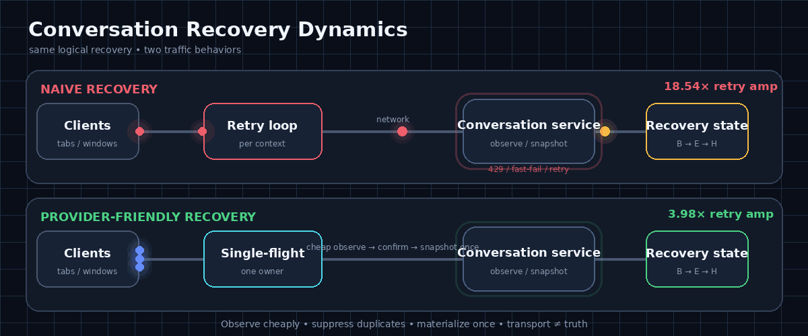

# ChatGPT Conversation Recovery Dynamics

A sanitized, client-side case study of a ChatGPT conversation-loading failure.

This repository does **not** claim to identify OpenAI's internal root cause.
It publishes sanitized derivative telemetry, a reproducible timing analysis,
a falsifiable mathematical model, and a client-side recovery proposal.

> **Recover. Don't amplify.**

  

  <a href="https://hopeless-t.github.io/chatgpt-recovery-dynamics/">Project Portal</a>
  ·
  <a href="https://hopeless-t.github.io/chatgpt-recovery-dynamics/network/">Animated Network</a>
  ·
  <a href="https://hopeless-t.github.io/chatgpt-recovery-dynamics/recovery-helper/">Recovery Helper</a>
  ·
  <a href="https://github.com/hopeless-t/chatgpt-recovery-dynamics/wiki">Wiki</a>

> **Visualization ≠ Evidence.** The animation explains the proposed recovery architecture; it is not a reconstruction of OpenAI's internal network.

## Evidence & mathematical model at a glance

| Layer | Result | Status |
|---|---|---|
| Pairing | 108 paired observations: 48 Accessible / 60 Blocked / 0 mixed | **Observed + reproducible** |
| Fast-fail timing | blocked snapshot median 325.6 ms vs accessible 5099.2 ms | **Observed** |
| Cycle law | `Delta ~= 5.616 + 0.957 S`, `R^2 = 0.99136` | **Recomputed / CI-checked** |
| Residual memory | AR(1) `phi ~= 0.524`; **Delta BIC ~= -29.3** vs independent residuals | **Deep validation** |
| Change point | best latency boundary equals first Blocked observation in **both epochs** | **Permutation-checked** |
| State persistence | `P(B_next | B) = 0.8621` after censoring the inactive epoch gap | **Observed + Wilson interval** |
| A->B biopsy | first A after B rebounded **8/8**; other A->B only **2/40** | **Observed; Fisher p ~= 1.19e-7** |
| History model | H/E/B history-aware model vs A/B first-order: **Delta BIC ~= -28.6** | **Model competition** |
| Healthy-cycle bootstrap | Accessible median cycle 95% bootstrap interval: **10.002–10.987 s** | **30k bootstrap resamples** |
| Robust controller | start-to-start anchor near 10 s | **Monte Carlo stress-tested, not production-proven** |
| Transport redesign | request-pressure recovery: **20.36% -> 68.18%** with anchor+single-flight; observe-first cuts mean payload to **4.62 MiB** | **5k-trial stress simulation** |
| Popular-server congestion | at base `rho=0.90`, retry amplification **18.54x -> 3.98x**; sampled knee **0.98 -> 1.00** | **local server-load simulation** |
| Public-report archaeology | 15 archived Reddit/HN artifacts; 13 in default weak-evidence subset | **Historical weak evidence** |
| 2026 recurrence | 12 retained report dates spanning **185 days** | **Archive recurrence, not prevalence** |
| Long archaeology span | oldest-to-newest retained report span: **1,301 days** | **Historical continuity only** |

### Core mathematical model

The directly observed timing layer is:

~~~text
Delta_n = S_n + W_n

Delta_n ~= 5.6164 + 0.9566 * S_n
R^2 = 0.99136
~~~

where:

- `S_n` is the slower service/failure latency in the paired observation;
- `W_n` is post-completion wait;
- `Delta_n` is start-to-start time to the next observation cycle.

The corresponding observation throughput is approximately:

~~~text
X ~= 1 / (S + W)
~~~

A conditional pressure-feedback hypothesis is:

~~~text
dP/dt = alpha * X(t) - delta * P(t) + xi(t)

Pr(429) = sigmoid(P(t) - Theta(t))
~~~

If pressure causes faster rejection, so `dS/dP < 0`, then:

~~~text
dX/dP = -S'(P) / (W + S(P))^2 > 0
~~~

and a local self-amplifying regime is possible when:

~~~text
alpha * (-S'(P)) / (W + S(P))^2 > delta
~~~

That final feedback inequality is a **falsifiable causal hypothesis**, not an
identified OpenAI internal mechanism.

The robust controller suggested by the observed timing law is:

~~~text
X_controlled = 1 / max(S + W, T_normal)

next_start >= previous_start + T_normal
~~~

with `T_normal ~= 10 s` for this capture, derived from the bootstrap interval
of the Accessible cycle.

The transition biopsy adds a history-aware recovery state:

~~~text
B / Blocked --success--> E / Recovering
E / Recovering --stable confirmation--> H / Healthy
E / Recovering --failure--> B / Blocked
~~~

Observed within active epochs:

~~~text
B -> E -> B : 8
B -> E -> H : 0
~~~

so a single successful observation is treated as **provisional recovery**, not
proof of stability.

Full derivation: [docs/model.md](docs/model.md)  
Validation: [docs/validation.md](docs/validation.md)  
Monte Carlo: [docs/monte-carlo.md](docs/monte-carlo.md)  
Transition biopsy: [docs/transition-biopsy.md](docs/transition-biopsy.md)  
Model competition: [docs/transition-model-competition.md](docs/transition-model-competition.md)  
Transport redesign: [docs/transport-recovery-redesign.md](docs/transport-recovery-redesign.md)  
Server-friendly congestion control: [docs/server-friendly-congestion-control.md](docs/server-friendly-congestion-control.md)  
External archaeology: [docs/external-evidence.md](docs/external-evidence.md)

> **Evidence discipline:** local HAR-derived telemetry drives the quantitative
> model. Reddit/Hacker News reports are preserved as weak historical
> observations and model constraints; they are not treated as IID samples or as
> proof of a shared root cause.
>
> **Responsible testing:** this repository does not recommend active load tests,
> rate-limit bypass, or synthetic retry storms against production OpenAI
> services. Congestion experiments are local simulations.

## Start here

- [Mathematical model](docs/model.md)
- [Independent validation / model audit](docs/validation.md)
- [Deep trace validation](docs/deep-validation.md)
- [Evidence / hypothesis ledger](docs/evidence-ledger.md)
- [Recovery design proposal](docs/recovery-design.md)
- [Robust Monte Carlo stress test](docs/monte-carlo.md)
- [A -> B transition biopsy](docs/transition-biopsy.md)
- [Transition model competition](docs/transition-model-competition.md)
- [Transport / recovery-path redesign](docs/transport-recovery-redesign.md)
- [Provider-friendly congestion control](docs/server-friendly-congestion-control.md)
- [Provider-friendly recovery checklist](docs/provider-friendly-checklist.md)
- [External public-report archaeology](docs/external-evidence.md)
- [Methodology](docs/methodology.md)
- [Public quantitative summary](data/summary.json)
- [Responsible testing](RESPONSIBLE_TESTING.md)
- [Bilingual Recovery Helper](docs/recovery-helper/README.md)
- [Animated network visualizer](https://hopeless-t.github.io/chatgpt-recovery-dynamics/network/)
- [Research Wiki](https://github.com/hopeless-t/chatgpt-recovery-dynamics/wiki)

## Repository infrastructure

  

This repository now also maintains the deliberately excessive project surface:

- [Paper / technical report](docs/paper/PAPER.md)
- [Generated paper PDF](docs/paper/chatgpt-recovery-dynamics-paper.pdf)
- [Architecture Decision Records](docs/adrs/)
- [RFCs](rfcs/)
- [FAQ](FAQ.md)
- [Glossary](GLOSSARY.md)
- [Changelog](CHANGELOG.md)
- [v0.1.0 release notes](releases/RELEASE-NOTES-v0.1.0.md)
- [Branding / visual identity](BRANDING.md)
- [Purrtocol mascot brief](docs/mascot.md)
- [パケニャの会話復旧相談室](https://hopeless-t.github.io/chatgpt-recovery-dynamics/cm/)

**Purrtocol** is the Recovery Cat. Its motto is:

> **Retry less. Observe more.**

No empirical reason for the cat has been established.

## Recovery Helper for affected users

The repository now includes a **bilingual Japanese/English, local-only
Recovery Helper** for people who are actively affected by conversation-loading,
429, blank-screen, WebSocket, or recovery-related failures.

~~~text
docs/recovery-helper/index.html
~~~

Design contract:

- no automatic ChatGPT/OpenAI API requests;
- no fetch/WebSocket/EventSource/sendBeacon;
- no cookies or browser storage;
- no analytics/telemetry;
- no external JavaScript, images, or fonts;
- official OpenAI guidance and research-derived suggestions are visibly
  separated;
- support-request notes are generated locally in the browser;
- language switching is available for the full UI, troubleshooting plan, and
  support memo.

The Helper is intentionally designed to avoid turning troubleshooting into
additional retry traffic.

It is GitHub-Pages-ready from `/docs`. See
[Recovery Helper documentation](docs/recovery-helper/README.md).

> GitHub Pages is enabled from `main /docs`. The live project portal links the animated network, bilingual Recovery Helper, Wiki, and evidence ledger.

## Provider-friendly design objective

This repository is intentionally optimized for a constructive operator-facing
question:

> **How can conversation recovery add less avoidable load to an already-popular
> service while improving the user's probability of stable recovery?**

The proposed ordering is:

~~~text
1. suppress duplicate recovery at the client
2. observe cheaply before materializing
3. honor server-directed spacing / Retry-After
4. use jitter and one retry owner
5. bound queues and shed load early
6. protect useful foreground work under true saturation
7. use HTTP/2 or HTTP/3 as transport improvements, not as substitutes for
   congestion control
~~~

A local popular-server stress model varies base foreground load `rho` from
0.70 to 1.10 before recovery traffic is added.

At `rho=0.90`:

| Policy | Retry amplification | Recovery payload | Recovery rejects |
|---|---:|---:|---:|
| naive completion | **18.54x** | 847.4 MiB | 1298.2 |
| Retry-After + jitter | 6.24x | 474.2 MiB | 395.9 |
| single-flight + observe | 4.16x | **366.6 MiB** | 92.8 |
| server-friendly stack | **3.98x** | **366.6 MiB** | **78.3** |

At `rho=1.00`, the abstract reference run gives:

~~~text
naive recovery completion          = 0.8896
server-friendly recovery completion = 1.0000

naive retry amplification          = 62.91x
server-friendly retry amplification = 7.49x
~~~

The conservative sampled operational knee moves from approximately:

~~~text
naive completion:        rho = 0.98
provider-friendly paths: rho = 1.00
~~~

These are **simulation results, not OpenAI production estimates**.

The deeper conclusion is more general:

> once sustained foreground load reaches capacity, retry logic cannot create
> more capacity. The safe action becomes graceful degradation / load shedding,
> while upstream duplicate suppression prevents recovery traffic from moving
> the overload knee earlier.

See [provider-friendly congestion control](docs/server-friendly-congestion-control.md),
[provider-friendly checklist](docs/provider-friendly-checklist.md), and
[server congestion reference](data/server_congestion_reference.json).

## Deep validation: what is still left after R² = 0.991

The timing law explains almost all start-to-start variance, but its residuals
are **not** white noise.

~~~text
Delta_n = 5.6164 + 0.9566 S_n + u_n

u_n ~= 0.524 u_(n-1) + epsilon_n
~~~

Adding AR(1) residual memory improves BIC by about **29.3 points** and reduces
residual SSE by about **27.4%**.

The post-completion wait itself has stronger lag-1 persistence:

~~~text
phi_W ~= 0.676
~~~

The same trace also passes several robustness checks:

- 108/48/60/0 pairing is unchanged for **10–100 ms** pairing windows;
- the transition matrix is unchanged for **20–600 s** epoch-gap thresholds;
- fitting the cycle law on one active epoch predicts the other with about
  **0.25–0.26 s RMSE**;
- the independently fitted service-time change point equals the first Blocked
  observation in **both epochs**;
- a history-free A/B model assigns only about **2.31e-5** posterior-predictive
  probability to the observed 8/8 reentry rebounds.

A fixed-trace accounting experiment also shows why full snapshots are a costly
health probe: the eight transient successful recovery snapshots represent
**36.59 MiB**, while 68 conceptual 4 KiB probes would be **0.266 MiB** on the
same observed state sequence. That is accounting only, not a causal production
estimate.

See [deep trace validation](docs/deep-validation.md).

## Main finding

The central observation is not simply “HTTP 429 happened.”

In the captured session, stream-status observation and conversation-snapshot
access switched together between two regimes:

- Accessible: stream 200 + snapshot 200
- Blocked: stream had no HTTP response + snapshot 429

The most important result after re-analysis is a timing relation:

~~~text
next-cycle gap ~= 5.616 s + 0.957 * current service/failure time
R^2 = 0.991
~~~

This means the higher attempt cadence in the blocked regime does **not** require
the client to deliberately choose a more aggressive retry policy.

A simpler mechanism is enough:

~~~text
request completes/fails
 -> roughly fixed post-completion wait
 -> next observation cycle
~~~

When a successful snapshot takes about 5 seconds, the cycle is roughly
10 seconds. When a blocked request fails in roughly 0.3 seconds, the same
post-completion wait produces a cycle near 6 seconds.

That is a **completion-coupled fast-fail cadence amplifier**.

If those additional attempts consume a constrained request/rate-limit budget,
a positive feedback loop becomes possible:

~~~text
throttling / blocked response
 -> failure completes faster
 -> observation cycles happen more often
 -> request-attempt pressure may rise
 -> throttling can become harder to escape
~~~

The first three arrows are directly compatible with the public timing data.
The final pressure/causality arrow remains a hypothesis.

## Why this is interesting

A UI that cannot render a conversation does not necessarily imply that the
canonical conversation is gone.

The capture contains states consistent with:

- conversation snapshots returning successfully while a resume request returns
  404;
- later transitions into a paired blocked regime;
- blocked observations occurring at a faster cadence than accessible ones;
- brief accessible excursions inside longer blocked periods;
- a later successful long-lived resume after WebSocket reconnection activity.

This suggests a useful systems principle:

> **Observed failure != global system failure.**

Conversation availability, snapshot accessibility, stream observability,
recovery attachment and user-visible readability should not automatically be
collapsed into one WORKING/BROKEN bit.

## Dataset

Raw HAR files are **not** included.

Only derivative fields are published:

- relative time from the first retained event;
- coarse event class;
- HTTP/transport status;
- request latency;
- payload size rounded to 4 KiB.

Excluded data includes:

- private session material;
- request/response headers;
- request/response bodies;
- account, user, project and conversation identifiers;
- exact URLs and query strings;
- absolute timestamps;
- message content.

See [docs/privacy.md](docs/privacy.md).

## Observed session

Two HAR captures were available. Capture A contained 345 entries; 341 matched
entries in the larger 1,705-entry Capture B.

To avoid double counting, quantitative analysis uses **Capture B only**.

Among retained recovery-related events:

| Event class | Count |
|---|---:|
| stream status observations | 122 |
| conversation snapshots | 114 |
| WebSocket attempts | 14 |
| conversation resume attempts | 3 |
| **total** | **253** |

## Coupled accessible / blocked regimes

A stream-status observation and conversation snapshot are paired when their
start times differ by no more than 50 ms.

The public JSONL reproduces:

| Regime | stream status | snapshot | Count |
|---|---|---|---:|
| Accessible | HTTP 200 | HTTP 200 | 48 |
| Blocked | no HTTP response | HTTP 429 | 60 |
| Mixed | any other combination | — | **0** |

Maximum observed pair-start skew is 9 ms.

The absence of mixed pairs is consistent with a shared latent regime affecting
multiple client-visible observations. It does not identify that regime's
server-side implementation.

## Cadence and latency shift

Median time until the next paired observation:

- Accessible: **10.272 s**
- Blocked: **5.998 s**

That corresponds to about a **1.71x higher median observation-cycle rate** in
the blocked regime.

Median latency:

| Metric | Accessible | Blocked |
|---|---:|---:|
| stream-status latency | 3570.987 ms | 340.994 ms |
| snapshot latency | 5099.195 ms | 325.632 ms |

The blocked snapshot path fails about **15.7x faster** by median latency.

### Cycle-time decomposition

For each within-epoch transition, define service time as the slower latency of
the paired stream/snapshot requests.

Across 106 active transitions:

~~~text
gap_s ~= 5.6164 + 0.9566 * service_s
R^2 = 0.99136
~~~

A robust Theil-Sen fit is also close:

~~~text
gap_s ~= 5.7017 + 0.9220 * service_s
~~~

Median inferred post-completion wait:

- Accessible: **5.383 s**
- Blocked: **5.647 s**

Adding a blocked-state indicator after service time contributes essentially
nothing to fit (about -0.0066 s).

See [docs/validation.md](docs/validation.md).

## Persistence and epoch boundary

The paired sequence contains one approximately **775.640 s** inactive gap.
That cross-gap adjacency is treated as an epoch boundary rather than a normal
state transition.

Within active epochs:

- Accessible -> Accessible: 38
- Accessible -> Blocked: 10
- Blocked -> Accessible: 8
- Blocked -> Blocked: 50

Therefore:

~~~text
P(Blocked next | Accessible) = 0.208333
P(Blocked next | Blocked)    = 0.862069
~~~

The blocked state is persistent in this capture.

There are 10 blocked runs. Two terminate at active-epoch boundaries and are
right-censored.

## Observation-count bias

Blocked cycles are shorter, so they produce more observations per unit time.

- blocked fraction by observation count: **55.6%**
- blocked fraction across active start-to-start time: **40.2%**

This is why the timing layer is better treated as a Markov renewal /
semi-Markov observation process rather than interpreting pair counts as
wall-clock occupancy.

## Resume observations

Two resume attempts returned HTTP 404 before later snapshot-429 periods.

Episode 1:

- first later snapshot 429: **349.013 s**
- successful snapshots first: **32**
- public rounded snapshot payload first: **146.375 MiB**

Episode 2:

- first later snapshot 429: **87.853 s**
- successful snapshots first: **8**
- public rounded snapshot payload first: **36.594 MiB**

A later resume attempt returned HTTP 200 and remained active for about
**135.8 s**.

These timings weaken a simple “429 always causes resume failure” story.
They do **not** prove that a resume 404 causes a later 429.

The very different successful-count / payload totals also do not support a
simple fixed snapshot-count or fixed-byte threshold from this sample.

## DCS-inspired mathematical model

The model separates client-visible state:

~~~text
x_t = (C_t, A_t, O_t, R_t, P_t, Theta_t, U_t)
~~~

where the variables represent canonical conversation availability, snapshot
accessibility, observability, recovery attachment, latent pressure, an
effective threshold/capacity state and user-visible utility.

The key revised mechanism is:

~~~text
Delta_n = S_n + W_n
X ~= 1 / (S + W)
~~~

combined with a conditional pressure model:

~~~text
dP/dt = alpha * X(t) - delta * P(t) + xi(t)

Pr(429) = sigmoid(P(t) - Theta(t))
~~~

If higher pressure produces earlier rejection, so that service time falls as
pressure rises, a completion-coupled loop can acquire positive feedback.

The full derivation and falsification conditions are in
[docs/model.md](docs/model.md).

## A -> B transition biopsy and model competition

The next failure transition is dominated by **history**, not by the current
successful-request latency.

Among 48 Accessible-origin transitions:

~~~text
current A immediately after B:
    next B = 8 / 8

other Accessible observations:
    next B = 2 / 40
~~~

One-sided Fisher exact:

~~~text
p ~= 1.19e-7
~~~

A Jeffreys-prior model competition ranks the reentry-history partition first:

| Predictor model | LOO log loss | LOO Brier |
|---|---:|---:|
| **reentry history** | **0.199** | **0.0423** |
| previous gap <8 s | 0.205 | 0.0442 |
| run length <=2 | 0.364 | 0.1069 |
| epoch | 0.515 | 0.1662 |
| constant hazard | 0.533 | 0.1719 |
| service <5 s | 0.547 | 0.1765 |

The history-aware H/E/B chain improves on the first-order A/B chain by roughly:

~~~text
Delta AIC ~= -31.25
Delta BIC ~= -28.58
~~~

This makes recovery hysteresis a data-backed requirement for the proposed
client state machine.

See [transition biopsy](docs/transition-biopsy.md) and
[model competition](docs/transition-model-competition.md).

## Transport / recovery-path redesign

The proposed recovery path separates cheap observation from expensive snapshot
materialization and keeps correctness out of the transport session:

~~~text
local triggers
 -> single-flight recovery lease
 -> cheap state/version observation
 -> start-anchored retry if blocked
 -> E / Recovering on first success
 -> stable confirmation
 -> full snapshot once
 -> atomic reconcile
 -> optional realtime reattach
~~~

Transport preference:

~~~text
HTTP/2      preferred baseline
HTTP/1.1    correctness-preserving fallback
HTTP/3      optional path-survival acceleration
WebSocket   optional realtime notification only
~~~

In the 5,000-trial request-count-pressure stress model:

| Path | Stable recovery | Mean requests | Mean payload |
|---|---:|---:|---:|
| completion per context | 20.36% | 38.66 | 28.96 MiB |
| anchor + single-flight | **68.18%** | 11.29 | 13.49 MiB |
| observe -> snapshot | **68.18%** | 11.29 | **4.62 MiB** |

The observe-first path intentionally receives no rate-limit advantage in that
model: every request has equal pressure cost. Its benefit is lower expensive
materialization.

Under a separate byte/work-weighted pressure stress model, observe-first reaches
100% recovery with p95 70 s versus 68.98% / p95 370 s for repeated full
snapshots. That result is explicitly **hypothetical** and is not evidence about
the production limiter.

See [transport redesign](docs/transport-recovery-redesign.md) and
[data/transport_recovery_reference.json](data/transport_recovery_reference.json).

## Recovery proposal

The proposed client-side recovery rule is:

> **Do not let a fast failure automatically shorten start-to-start retry
> spacing.**

A conceptual scheduler is:

~~~text
next_start =
    max(
        last_start + minimum_period,
        now + error_backoff(error_class, consecutive_failures)
    )
~~~

The proposal also includes:

- exponential backoff + jitter for throttling;
- a bounded retry budget / circuit breaker;
- cheap re-observation before expensive full snapshots;
- single-flight snapshot recovery;
- preserving the last-known-good readable UI;
- atomic snapshot/version reconciliation;
- stream reattachment after state reconciliation;
- recovery hysteresis so one brief success does not reset all backoff state.

See [docs/recovery-design.md](docs/recovery-design.md).

## Robust Monte Carlo stress test

Because the production causal mechanism is not identified, the recovery policy
is also stress-tested against **three deliberately different models**:

1. an attempt-driven embedded Markov model, where waiting cannot make recovery
   progress;
2. a latent wall-clock clearing model, where polling only changes detection
   delay;
3. a hypothetical pressure-feedback model, where attempts consume a decaying
   pressure budget.

A 30,000-resample bootstrap puts the Accessible median cycle at approximately:

~~~text
95% bootstrap interval: 10.002 s .. 10.987 s
median:                 10.272 s
~~~

This makes a **~10 s start-to-start anchor** a data-derived conservative
controller rather than an arbitrary constant.

In the CI reference run (5,000 trials per policy/model), the 10 s anchor:

- preserves 99.96% recovery in the deliberately adverse attempt-driven model;
- reduces mean blocked probes from 6.85 to 4.32 in the latent wall-clock model,
  with p95 detection delay increasing from 5.79 s to 9.53 s;
- raises recovery rate from 52.68% to 69.10% in the hypothetical
  pressure-feedback stress model.

Stronger exponential backoff performs much better under pressure feedback, but
can perform much worse if the causal model is wrong. The robust core is
therefore:

> **first prevent fast failure from increasing start-to-start attempt rate;
> escalate backoff only with stronger evidence.**

See [docs/monte-carlo.md](docs/monte-carlo.md) and
[data/monte_carlo_reference.json](data/monte_carlo_reference.json).

## Reproduce from public data

The public event stream can be re-analyzed without a raw HAR:

~~~bash
python3 scripts/analyze_public_data.py
~~~

The script reconstructs the 108 pairs, censors the inactive epoch boundary and
recomputes the timing / transition statistics using only Python's standard
library.

To sanitize your own local HAR first:

~~~bash
python3 scripts/extract_public_events.py input.har output.jsonl
python3 scripts/analyze_public_data.py output.jsonl
~~~

**Do not publish raw HAR files.** They can contain private session and account
material.

Review derivative output manually before publishing it.

## Numerical precision check

The cycle-time fit is small and well conditioned:

- design-matrix condition number: about **5.62**
- normal-matrix condition number: about **31.6**

An 80-digit recomputation agrees with ordinary binary64 at all displayed OLS
coefficient digits.

Accurate matrix-multiplication methods such as the Ozaki scheme are therefore
not needed for this fit: observation/model uncertainty dominates floating-point
roundoff.

See [docs/validation.md](docs/validation.md) for the numerical audit.

## Files

- data/session_b_events.jsonl — sanitized relative event stream
- data/paired_observations.csv — 108 paired observations
- data/summary.json — quantitative summary
- data/monte_carlo_reference.json — CI Monte Carlo reference output
- data/external_observations.jsonl — curated Reddit/HN archaeology archive
- data/external_summary.json — weak-evidence corpus summary
- data/official_incidents.jsonl — official incident context
- data/transition_biopsy_reference.json — A->B biopsy/model reference
- data/transport_recovery_reference.json — transport-path simulation reference
- data/server_congestion_reference.json — popular-server congestion reference summary
- data/deep_validation_reference.json — sensitivity / residual / change-point reference
- docs/model.md — revised DCS / feedback model
- docs/validation.md — independent recomputation and model audit
- docs/recovery-design.md — concrete client-side recovery proposal
- docs/monte-carlo.md — robust policy stress test under causal-model uncertainty
- docs/external-evidence.md — public-report archaeology and model constraints
- docs/transition-biopsy.md — A->B pre-transition biopsy
- docs/transition-model-competition.md — history-vs-latency model competition
- docs/transport-recovery-redesign.md — protocol/path redesign and simulation
- docs/server-friendly-congestion-control.md — provider-friendly overload/admission design
- docs/provider-friendly-checklist.md — compact operator/design review checklist
- docs/deep-validation.md — residual dynamics, sensitivity and change-point audit
- docs/evidence-ledger.md — observed / supported / compatible / unknown separation
- docs/recovery-helper/index.html — bilingual local-only user troubleshooting service
- docs/methodology.md — pairing, sessionization and analysis rules
- docs/privacy.md — sanitization policy
- scripts/extract_public_events.py — HAR -> public event extractor
- scripts/analyze_public_data.py — public JSONL -> reproduced statistics
- scripts/monte_carlo_recovery.py — bootstrap + three-model policy stress test
- scripts/analyze_external_evidence.py — reproducible Reddit/HN archaeology summary
- scripts/analyze_transition_biopsy.py — A->B transition biopsy
- scripts/compete_transition_models.py — small-sample transition model competition
- scripts/simulate_transport_recovery_paths.py — protocol/path stress simulation
- scripts/simulate_server_congestion.py — popular-server pressure-knee simulator
- scripts/deep_validate_trace.py — sensitivity, residual, change-point and replay audit

## Scope and limitations

This is one observed user session, not a population study.

The data can show ordering, coupling, persistence, timing relations, cadence
changes and compatibility with hypotheses.

It cannot establish:

- OpenAI's internal implementation;
- the semantic meaning of a particular 404;
- whether a rate limiter is account-, endpoint-, edge-, or service-scoped;
- whether WebSocket failure is the initiating cause;
- whether increased observation traffic causes the 429 state;
- whether the same mechanism applies to every reported ChatGPT
  conversation-loading failure.

The right next step is replication across independent users, clients,
conversation sizes and network conditions.

## Responsible disclosure / privacy

This repository intentionally publishes **derived telemetry, not credentials or
raw traffic**.

If you want to contribute a capture, publish only sanitized derivative events.

Do not attach raw HAR files to public GitHub issues.

## License

MIT. See [LICENSE](LICENSE).

## Disclaimer

Independent observational research. Not affiliated with or endorsed by OpenAI.
